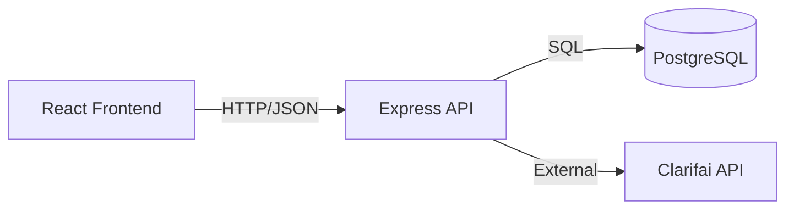

# 🧠 Face Recognition Brain


**Live Demo:** [https://smart-brain-i48y.onrender.com](https://smart-brain-i48y.onrender.com)


Front-end for the **Smart Brain app** built with **React (Vite)** and designed to connect with the Node.js + Express backend.  
Users can sign in, submit image URLs, and view detected faces returned from the API via the backend service.  

The interface is clean, fully responsive, and enhanced with a **particles background**, a **3D tilt logo**, and **Tachyons CSS**.


**Backend Repository:** [SmartBrain API (Node.js + Express)](https://github.com/PedroTeixeira2308/Smart-Brain-API.git)


## Tech Stack

- **React.js** (Class Components)
- **Vite** (Development + Build Tool)
- **[Tachyons CSS](https://tachyons.io/)** (utility-first styling)
- **[React Tilt](https://www.npmjs.com/package/react-parallax-tilt)** (3D logo animation)
- **[Particles BG](https://www.npmjs.com/package/particles-bg)** (interactive background)
- **JavaScript (ES6+)**
- **HTML5 / CSS3**
*(Connected to Smart Brain API v1.1.1 — now supports PostgreSQL, bcrypt authentication, and Clarifai image recognition via backend)*


## Architecture Overview



## Version History

| Version | Description |
|----------|--------------|
| **v1.2.0** | Frontend deployed (Render), centralized API config via `.env.local`|
| **v1.1.1** | Code Review Improvements|
| **v1.1.0** | Added notifications for login/register feedback, improved form validation |
| **v1.0.0** | First complete version — Front-end (React) integrated with backend (Node.js + Express) and Clarifai API logic handled server-side |


---

## What's New (v1.2.0)

- Frontend successfully deployed to Render as a **Static Site**
- Added `.env.local` configuration for environment variables (`VITE_API_URL`)
- Centralized API endpoints into `src/config/api.js`
- Improved development setup and documentation
- Added **notifications** for invalid login or registration attempts  
- **form validation** with user-friendly messages  
- Better **error handling** in `fetch` requests to backend  


## What I Learned

- Structuring a React project from scratch using **Class Components**  
- Dividing the UI into **modular, reusable parts** (Navigation, Logo, Rank, Input Form, Face Recognition, etc.)  
- Using **Tachyons** for quick and consistent styling  
- Implementing **React Tilt** for a 3D logo effect  
- Adding **Particles Bg** for animated and dynamic backgrounds  


## Setup

```bash
# Clone the front-end repository
git clone https://github.com/PedroTeixeira2308/Smart-Brain.git

# Enter the project folder
cd smart-brain

# Install dependencies
npm install

# Create a local environment file
# .env.local
VITE_API_URL=https://<your-backend-api>.com

# Start the development server
npm run dev


#Backend (required)

> Make sure the backend server is running locally before testing the front-end.  
> Clone and start it from here:  
> [SmartBrain API (Node.js + Express)](https://github.com/PedroTeixeira2308/Smart-Brain-API.git)

```

## Project Structure
```markdown
src/
┣ assets/
┣ Components/
┃ ┣ FaceRecognition/
┃ ┃ ┣ FaceRecognition.css
┃ ┃ ┗ FaceRecognition.jsx
┃ ┣ ImageLinkForm/
┃ ┃ ┣ ImageLinkForm.css
┃ ┃ ┗ ImageLinkForm.jsx
┃ ┣ Logo/
┃ ┃ ┣ brain.png
┃ ┃ ┣ Logo.css
┃ ┃ ┗ Logo.jsx
┃ ┣ Navigation/
┃ ┃ ┗ Navigation.jsx
┃ ┣ Rank/
┃ ┃ ┗ Rank.jsx
┃ ┣ Register/
┃ ┃ ┗ Register.jsx
┃ ┗ SignIn/
┃ ┃ ┗ SignIn.jsx
┣ config/
┃ ┗ api.js
┣ App.css
┣ App.jsx
┣ index.css
┗ main.jsx
```

## Features

- Sign In and Sign Out components

- Submit image URLs for face detection

- 3D tilt logo built with **`react-parallax-tilt`**

- Particles background using **`particles-bg`**

- Responsive layout built with Tachyons

- Clean, modular structure ready for backend integration

- Integrated with real authentication backend (PostgreSQL + bcrypt)

- Notifications for errors and validations

- Environment-based API configuration using `.env.local` and centralized helper (`src/config/api.js`)

- Fully deployed version with SPA routing (`/* → /index.html`)


## Author

Pedro Teixeira — Full-Stack Developer
[GitHub](https://github.com/PedroTeixeira2308) | [LinkedIn](https://www.linkedin.com/in/pedro-teixeira-967615347
)


## License

[MIT](https://choosealicense.com/licenses/mit/)